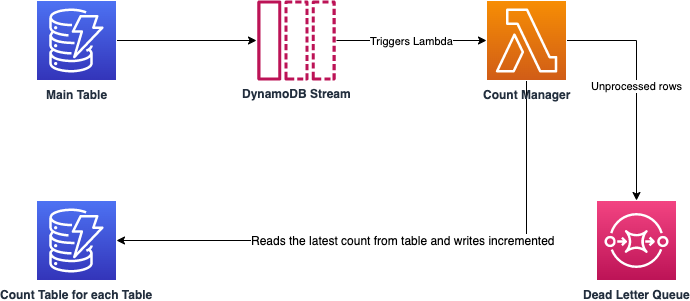

# A More Accurate Way to Keep Approximate Count of DynamoDB Table

## About this Artifact
DynamoDB Count currently can be retrieved either by a full table scan and count or relying on the `ItemCount` attribute of the `describe-table` command from `aws cli`. The former approach is inefficient and very costly. The latter approach is only accurate as of six hours ago.

This artifact allows a more accurate and customizable way of retrieving the count of the table through the use of dynamoDB stream. It contains sample CDK code to set up a brand new DynamoDB table and the infrastructure and Lambda code needed to deliver a much more accurate approximation of the count.

Another advantage of this approach is development work involving the DynamoDB table does not have to do any extra work about the count table. Once set up, the count is updated.

This artifact is intended for infrastructure developers who wish to set up a simple way to keep count of table counts. The result is also useful for any user that needs to know the accurate current item count.

## Pre-requisites
 1. [CDK](https://aws.amazon.com/cdk/)
 2. An AWS account user/role that allows you to deploy `CloudFormation` stacks

## Running the Sample Code
### Location
https://gitlab.aws.dev/guoneng/approximate-dynamodb-count
### Content
1. CDK infrastructure code in TypeScript setting up the main DynamoDB table and the count table, along with the DynamoDB Stream and EventSource for Lambda.
2. Lambda code in TypeScript to update the count.
3. Working test code.
### What The CDK Generates

### Steps
1. Set the minimal environment variables, as an example:
    ```bash
    export AWS_REGION=eu-west-1
    export AWS_ACCESS_KEY_ID=SOMEACESSKEYID
    export AWS_SECRET_ACCESS_KEY=SOMESECRETACCESSKEY
    export AWS_SESSION_TOKEN=SOMETOKEN
    ```
    Note that the access information needs to be bound to a user/role that has the access `CloudFormation` needs to create the resources.
3. Install CDK dependencies
```
npm install
```
2. Bootstrap CDK
  ```bash
  cdk bootstrap
  ```
3. Deploy
  ```
  cdk deploy
  ```

## Discussion
### Better than `ItemCount` but Still Approximate
The asynchronous nature of keeping count provides the advantage of separating the normal work with the main table from the logic of keeping count. However, it also means the count is not up to date immediately. It depends on how soon the stream is read, and in what batches.

This is still far more accurate than the `ItemCount` property of the DynamoDB Table call, which is set to be accurate as of six hours ago.

Note that the count table is not specific to the main table. The main table's count represents in this case only one row. It's possible to register more tables for this count table.

There is also the possibility to create more complex count when the main table has sort key as part of its primary key, or if local secondary indexes are available.

This artifact serves as a starting point for further improvement. But on its own, it can already provide the infrastructure and lambda code to provide a more accurate count.

### Alternatives
In the sample you'd be using a separate table to keep the count for all the tables using it. To reduce the overhead of managing a separate table, you can keep a single row with the count within the table for which the count is approximating. However, from a design point of view, this table now contains two sets of information: the main information and a metadata row.

## Destroying the sample
When ready to delete all the resources created by the sample, simply run:
```bash
cdk destroy
```

## Security

See [CONTRIBUTING](CONTRIBUTING.md#security-issue-notifications) for more information.

## License

This library is licensed under the MIT-0 License. See the LICENSE file.

